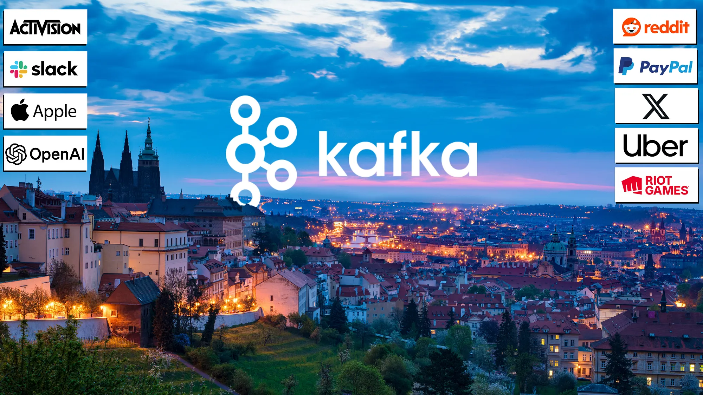
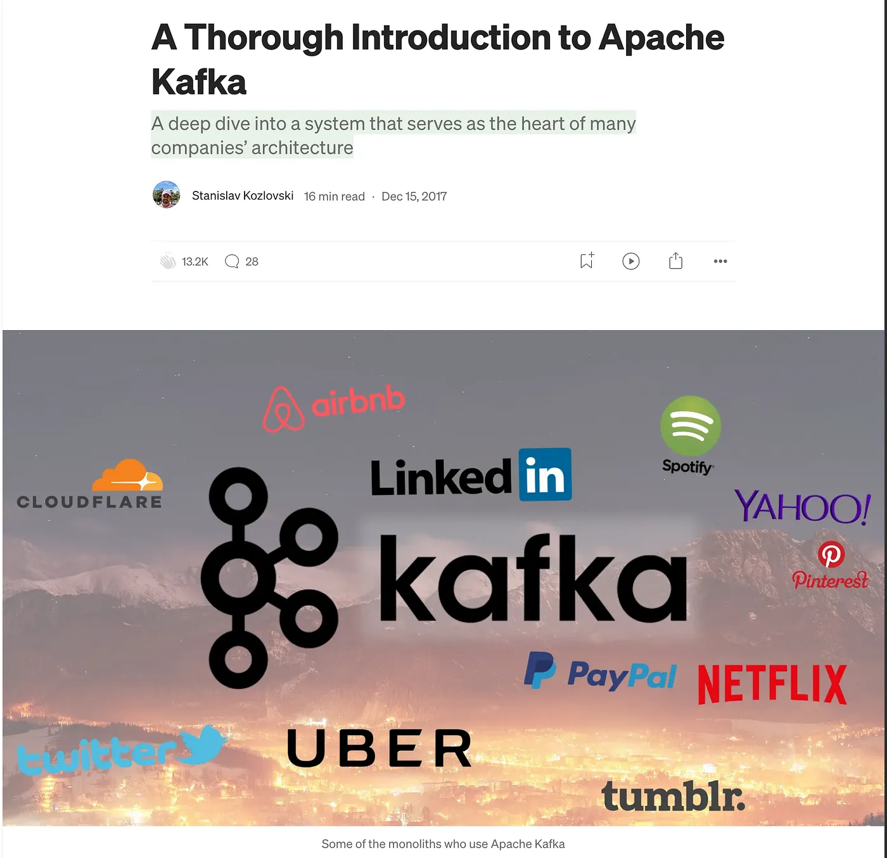
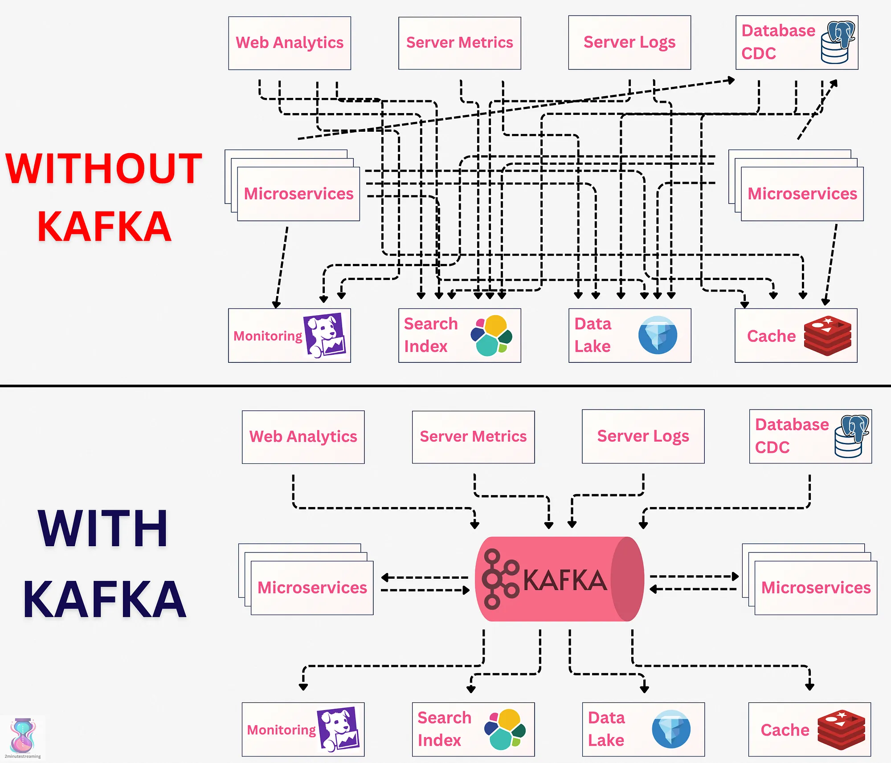
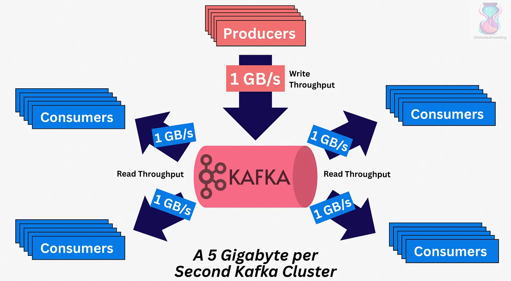

# Introduction

## The most complete and detailed explanation of Kafka on the internet

Prague, where Franz Kafka was born.

Everyone always asks me:

> \> What’s a resource you would recommend to learn Kafka?

- I used to recommend [the books about Kafka](https://kafka.apache.org/community/books_and_papers/), but most people don’t have the time to dedicate to a whole book and frankly, they don’t need them.
- There are *some* good articles on Kafka out there but they’re incomplete;
- And, more importantly, there are a ton of badly-written AI blogs out there. Open any such one, and you will see the same words being used to describe the system:

> “It’s an open-source, distributed, durable, very scalable, fault-tolerant pub/sub message system with rich integration and stream processing capabilities.”

While it’s technically true, it isn’t practically helpful for a novice reader being introduced to Kafka for the first time.

Today, I present you with the single best, most-thorough single resource on the internet about Apache Kafka. We will explain Kafka by **precisely breaking down** what ***every*** word in that definition means, and *a lot more*. (watch for the **💡** emoji marking each word’s definition)

At the end, you will have **a complete** high-level understanding of Apache Kafka.

## Why Trust My Explanation?🧐

I went viral explaining Kafka way back in 2017 (9 years ago now… wow) — that article was so informative and unique that it got over 200,000 views and 13.2k claps on Medium, AND landed me a job.

the good old times

> *It landed me a job at Confluent (a company founded by the creators of Kafka), where I worked very hard as a software engineer on Apache Kafka directly for 6 years and became* [*a committer to the project*](https://kafka.apache.org/community/committers/)*. I’ve since grown* [*a newsletter*](https://blog.2minutestreaming.com/) *about Kafka to over 7000+ subscribers and collected over 50,000 followers on* [*social*](https://x.com/kozlovski) [*media*](https://www.linkedin.com/in/stanislavkozlovski/) *from sharing useful insights about data engineering. I literally call myself* [*“The Kafka Guy”*](https://www.linkedin.com/in/stanislavkozlovski/) *(half-jokingly, half-true)*

Quite a lot of things have changed since — both in my understanding and in the underlying technology — so this warrants a completely new article. One that’s better than ever.

This is it, and it’s 100% free. Enjoy:

## Apache Kafka

Apache Kafka is one of the most popular open-source projects in the data infrastructure space. It is a standard tool in every data engineer’s catalog, used by over 70% of Fortune 500 companies and 150,000 organizations. Names like OpenAI, Twitter (X), Reddit, Datadog, Newrelic, Paypal, Cloudflare, Airbnb, LinkedIn, Riot Games, etc.

Kafka is a messaging system that was originally developed by LinkedIn in 2010. In 2011, it was open-sourced and donated to the Apache Foundation.  
*That’s why its official name is “Apache Kafka”, but we still call it Kafka for short.*

> ***💡* open-source (1/8)**

Nowadays, Kafka is more than a simple messaging system: it’s a larger ecosystem of components that form a **streaming platform**. It is frequently called the swiss army knife of data infrastructure.

> ***A Streaming Platform*** means a system that allows you to store and process a large volume of streams of data. For example, a company like Uber has millions of drivers constantly streaming their GPS coordinates to Uber’s backend systems. A streaming platform can scale this data and process it in real time as it comes. This helps Uber make use of the data (e.g, recompute the route, figure out where there is traffic, etc).

## Kafka’s Story

Why did Kafka become so widely used and known?

Because it solved a very important problem — the problem of **data integration at scale**.

LinkedIn had to connect different services to one another.

A naive way of achieving this would have beento create many custom point-to-point integrations (called **data pipelines**) between each service.

That would have resulted in an **O (N²)** mess that would break often and be impossible to maintain when N is in the hundreds:

a simple visualization of the problem

Apache Kafka flips this problem on its head. Instead of creating custom pipelines per connection, it encourages organizations to:

1. Store their data in a central location (Kafka)
2. Use a single standard API (the Kafka API)
3. Have applications subscribe and consume this data in real time

This decouples writers from readers, as writers simply publish to Kafka, and readers subscribe to Kafka.

The data gets durably persisted to disk for a limited amount of time (e.g., 7 days).

Kafka is ideal and was built with **read-fanout** use cases in mind, where the same message needs to get read by multiple systems. As such, it’s common for the system’s read throughput to be a multiple of its write throughput.

> *💡* **pub-sub messaging system (2/8)** *— this is what a pub/sub event log messaging system is. A message can be read multiple times, as opposed to a queue where it’s typically read once.*

With Kafka, organizations don’t need to maintain dozens of fragile custom point-to-point pipelines that break whenever a single VM restarts. The data can be written to Kafka once and read as many times as necessary by whatever system needs it.

> *In this article, we won’t talk further about the use cases of Kafka. If you’re more interested in the reason behind Kafka, I recently covered in-depth why LinkedIn created Kafka. It made the front page of Hacker News.*
> 
> *✅ Check it out* [*here*](https://bigdatastream.substack.com/p/why-was-apache-kafka-created)*.*

---

**Next:** [The Basics →](01-basics.md)
