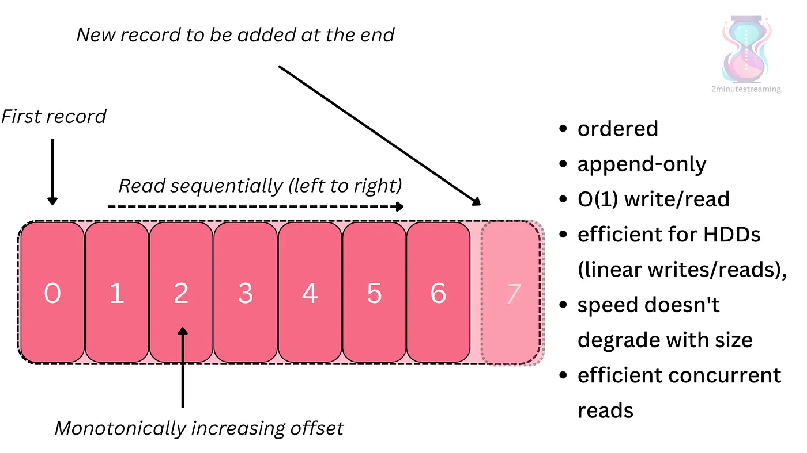
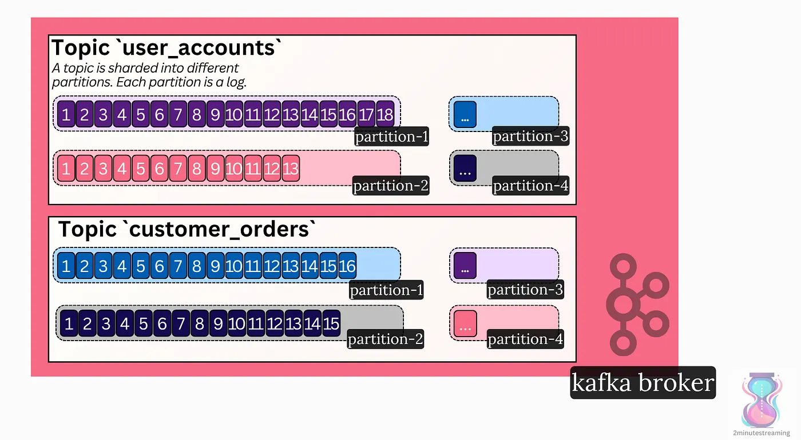

# The Basics

## The Basic Kafka Concepts

Okay, let’s dive into Kafka now! To truly understand the system, we need to start from the basics.

Let’s examine its core data structure:

### The Log Data Structure

Kafka is built upon the [simple log data structure](https://topicpartition.io/definitions/the-log).

It is append-only; you can only add records to the end of the log (no deletes or updates allowed). Reads go from left to right, in the order the records were added.

Each record in the log has a unique monotonically increasing number called an **offset**. The offset refers to the record and denotes its order.



[https://topicpartition.io/definitions/the-log](https://topicpartition.io/definitions/the-log)

The API of the log data structure is very simple:

```c
public interface Log {
  // save an entry to the end of the log
  void append(byte[] r);
```
```sh
// read a sequential chunk of the log
  byte[] read(int startOffset, int endOffset);
}
```

Kafka keeps the log structure on disk. The log’s sequential operations work very well with HDDs. Hard drives offer very high throughput for sequential reads and writes. This differs from random reads and writes, where HDDs don’t perform well.

> **A sequential read** means reading bytes laid out contiguously on the physical drive. Random reads mean the opposite — you have to jump to different parts of the drive to read the bytes.

### Records

> ***{record, message, event}*** *means an entry in the log and represents a data point. I use these words interchangeably when describing data in Kafka.*

Each message is essentially a key-value pair; it consists of a \` `byte[] key` \` and a \` `byte[] value` \` (although other metadata like offset, timestamp, and custom headers exist too). The key is optional; it is valid for a message to only have a value.

```c
/* A Kafka record/message/event is the smallest
logical unit of data stored in the log */
public class Record {
  private byte[] key; // optional
  private byte[] value;
}
```

The key thing to remember is that the key/value pairs are **raw bytes**.

Kafka does not inherently support types (e.g., int64, string, etc.) nor schemas (specific message structures).

It is the client-side code’s responsibility to apply schemas:

- **When writing**: producer clients convert (serialize) the objects into bytes.
- **When reading**: consumer clients parse (deserialize) the raw bytes from the network into the object.

## Topics & Partitions

### Topics

A topic is the logical separation of data (that you store in logs).

One log is not enough. You want to separate your data into categories. Just as in a database, you would create separate tables for user accounts and customer orders; in Kafka, you would create separate topics.

It’s common for a Kafka cluster to have hundreds to thousands of topics.

### Partitions

Kafka is a distributed system designed to scale much further than what a single machine can handle. As such, it uses **sharding**.

A topic is sharded into one or more partitions.

Each partition is a separate instance of the log data structure.

While a topic can have just one partition, it’s very common for it to have dozens, since this helps with parallelization of reads (more on that later).



Kafka can have many topics. Each topic has many partitions itself. A partition is a log. The log has many records.

> One of the age-old questions in Kafka is “how many partitions should my topics have?”.  
> There is no universally good answer to this question.  
> \- Too many partitions and your cluster pays a CPU overhead for maintenance (a ballpark of what a Kafka cluster can handle is up to 100–200k partitions total).
> 
> \- Too little partitions and your topic can’t scale to handle reads.
> 
> The important thing to know is that once created, a topic’s partitions **cannot** be reduced. They can be increased, but this introduces the shard remapping problem. In Kafka, this breaks ordering guarantees of the data written prior to the increase as records with a particular key may get routed to a new partition.

## Clients & The API

Kafka doesn’t use HTTP. It uses its own [TCP](https://networklessons.com/network-fundamentals/introduction-to-tcp-and-udp) -based protocol. This means that you need more custom code to send and receive requests; you can’t just use any HTTP library.

Kafka provides its own libraries that implement the underlying protocol. The main clients you’d care about are the **Producer** and the **Consumer**.

- **Producer**: the class that’s used for writing data to Kafka
- **Consumer**: the class that’s used for reading data from Kafka

The Apache Kafka project offers a Java library that implements these:

```c
import org.apache.kafka.clients.producer.KafkaProducer;
```
```sh
import org.apache.kafka.clients.consumer.KafkaConsumer;
```

The Producer class allows you to **send messages** to a topic. You can explicitly choose the partition or allow Kafka to do it automatically for you.

```c
KafkaProducer<String, String> producerClient = new KafkaProducer<>(props);
val record = new ProducerRecord<>("my-topic", desiredPartition, "key", "value")
producerClient.send(record);
val record2 = new ProducerRecord<>("my-topic",
/* ANY PARTITION (it's implicitly chosen) */ "key", "value")
producerClient.send(record2);
```

For reading, it’s the **Consumer** class and its API:

```c
KafkaConsumer<String, String> c = new KafkaConsumer<>(props);
// subscribe to specific partitions
c.assign(List.of(new TopicPartition("my-topic", 0)));
// or subscribe to the topic in general and
// let Kafka figure out which partition it’ll assign to you
c.subscribe(List.of("my-topic"));
```
```sh
// poll for the latest records
while (true) {
  ConsumerRecords<String, String> records = c.poll(Duration.ofMillis(100));
  for (ConsumerRecord<String, String> rec : records) {
    System.out.printf("Got record with key=%s and value=%s at offset %d %n",
      rec.key(), rec.value(), rec.offset());
  }
}
```

This is simply the most important API I can show you concisely; a lot more exist. Kafka may seem simple, but it has many details to learn to be effective with it.

## Message Order

Consumers are guaranteed to read the messages in the order in which they arrived on the server.

With one caveat — this only applies **within a single partition**.  
Between partitions, no order of messages exists.

Producers can explicitly choose the partition they produce to, or they can configure a specific partitioning strategy depending on the key of the record. This can ensure, for example, that website actions from the same user ID go to the same partition.

In practice, some big tech companies tend to omit ordering at the Kafka layer and utilize the random partition strategy in order to gain the best performance from load balancing. Others rely on the ordering.

No two consumers from the same group (more on what that is later) read the same partition at once. This guarantees that a single consumer instance will read said messages in order too, allowing it to perform local stateful actions on the data (e.g analysis/aggregation). This helps with scalability, as an important principle for performant distributed systems is to do as much work locally as possible.

## Basics Summary

This is the high-level of Kafka:

1. Messages are stored in topics.
2. Topics are sharded into 1 or more partitions (log data structures).
3. Each message in a partition has a unique offset denoting its position in that log, and messages are stored in the order in which they arrived.
4. Clients can choose to explicitly order messages depending on some characteristic, or can simply order at random for better performance.

If you are a high-level user of Kafka, this is more or less all that you need to know in order to build on top of it.

That being said, the system has many more specifics that it frequently forces you to learn. Let’s dive into them!

---

[← Previous: Introduction](00-intro.md) | **Next:** [Kafka as a Distributed System →](02-distributed-system.md)
