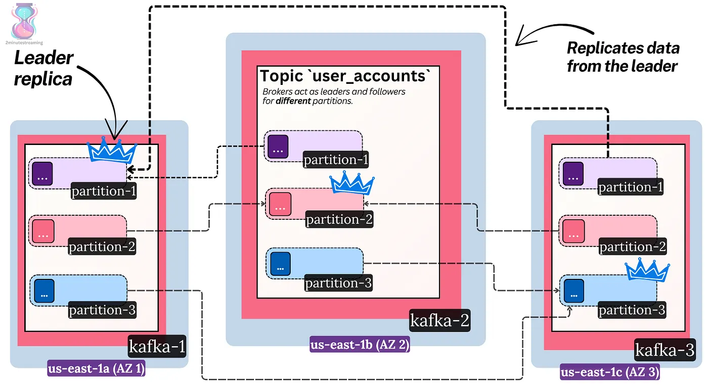
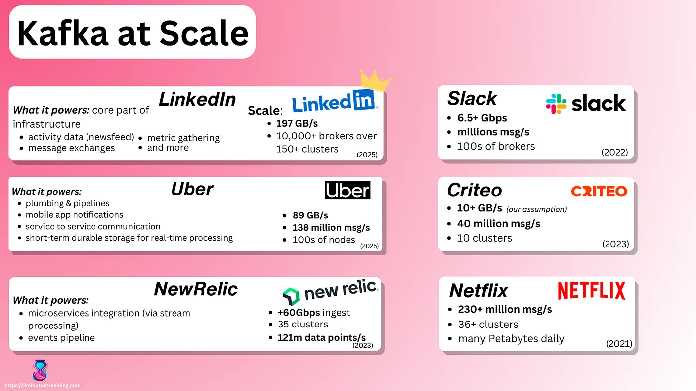

# Kafka as a Distributed System

Kafka is a distributed system — it’s common to have clusters with dozens of nodes (called brokers) and thousands of partitions. Let’s concisely go over some of the internals there:

## Brokers

Apache Kafka is designed to be a ***distributed*** system — one meant to scale horizontally by adding more nodes. As such, any normal deployment of Kafka consists of at least ***three nodes***.

- ***Broker***: an instance of the Kafka server. This is what we call a node in the system.

Brokers serve client requests. Stuff like the Produce request (what you send to write data to Kafka) and the Consume request (what you send to read data from Kafka)

- ***Cluster***: all the brokers in the system.

> *💡* **distributed (3/8)**

## Replication

A partition in Kafka doesn’t live only on one broker — it lives across many.

Kafka is a fault-tolerant system made to handle single machine failures and offer high durability so that you don’t lose your data if you lose a single broker. It achieves this through **replication** — partitions are replicated (i.e copied) at a configurable replication factor number — defaulting to three replicas.

A configurable setting (called **replication factor**) denotes how many copies should exist. The default and most common is **three**.

In other words, we have three copies (called **replicas**) of the Log data structure. These replicas live on the disks of different brokers.

The structure is roughly:

1. topics (have many)
2. partitions (have many)
3. replicas (have many)
4. files in a folder on a disk (that together form the full log)

Replication is done for many reasons, one of which is data **durability**: when three copies of the data exist, one disk failing won’t lead to data loss.

> **Durability** refers to long-term data protection — ensuring that data never gets lost or corrupted.

In modern cloud deployments, brokers are spread across different [availability zones](https://blog.2minutestreaming.com/p/basic-aws-networking-costs#:~:text=AZ%20\(Availability%20Zone\)%20%2D%20a%20physically%20isolated%20location%20with%20one%20or%20more%20data%20centers%2C%20inside%20a%20region). This ensures very high durability and availability. Even in the unlikely event of a whole data center burning down, the Kafka cluster would still survive.

> *💡* **durable (4/8)**

Kafka supports both synchronous and asynchronous replication from the point of view of the writer. It’s up to the Kafka client to specify which replication it would like to have. It depends on a client-side config — the producer’s \` [acks](https://blog.2minutestreaming.com/p/kafka-acks-min-insync-replicas-explained) \` config.

- **acks=all** (synchronous replication) — the producer receives a response only once all followers are confirmed to have replicated the data
- **acks=1** (asynchronous replication) — the producer receives a response only once the leader is confirmed to have received the write

Reads always use synchronous replication — a consumer can only read a message once it’s confirmed to have been replicated in every replica. This is done to avoid [phantom reads](https://blog.2minutestreaming.com/p/kafka-high-watermark-offset).

## Leaders

Once you start maintaining copies of data in a distributed system, you open yourself to a lot of edge cases. Keeping new data in sync is tricky. The copies must match, and the system needs to somehow agree on the latest state.

> *There is a whole class of complex algorithms in computer science called* [*distributed consensus*](https://sre.google/sre-book/managing-critical-state/)*, which handle this.*

Kafka uses a straightforward single-leader replication model. At any time, one replica serves as the leader. The other two replicas act as followers (i.e., hot standbys).

Only the leader accepts new writes — it serves as the source of truth of the log. The followers actively replicate data from the leader. Reads can be served from both the leader and its followers.

When a broker node goes offline, the system notices it. Other brokers then take over the leadership of the partitions the dead broker led. This is how Kafka offers high availability.

A topic with 4 partitions and a replication factor of 3, with different brokers leading different replicas of the partitions. Brokers with follower replicas send fetch requests to the brokers with leader replicas to replicate the data

> *💡* **fault-tolerant (5/8)**

## Scalability

Kafka has a ton of interesting performance optimizations (more on this in another article). Its greatest strength is its horizontal scalability.

> *💡* **scalable (6/8)**

The [Log data structure](https://topicpartition.io/definitions/the-log) is key to Kafka’s scalability — writes on it are O(1) and lock-free. This is because records are simply **appended to the end** and cannot be updated, nor individually deleted.

Messages within a partition are independent of each other. They have no higher-level guarantees like unique keys. This reduces the need for locking and allows Kafka to append to the Log structure as fast as the disk will allow.

Because each partition is a separate log, and you can add more brokers to the cluster, your scale is limited by how many brokers you can add.

Nothing theoretically stops you from having a Kafka cluster that accepts **50 GiB/s of writes** and then scaling it 2x to **100 GiB/s**.

> Theoretically, you can do this by using very good high-end hardware with ample networking capacity. An example could be 75 brokers each accepting 512 MiB/s of writes. Modern SSDs can do this without a problem. Practically speaking, it would be very hard to operate and may require custom code. Therefore most prefer to split such workloads into many clusters.

Some of the biggest Kafka deployments that have been publicly shared

---

[← Previous: The Basics](01-basics.md) | **Next:** [Metadata & Controllers →](03-metadata-and-controllers.md)
