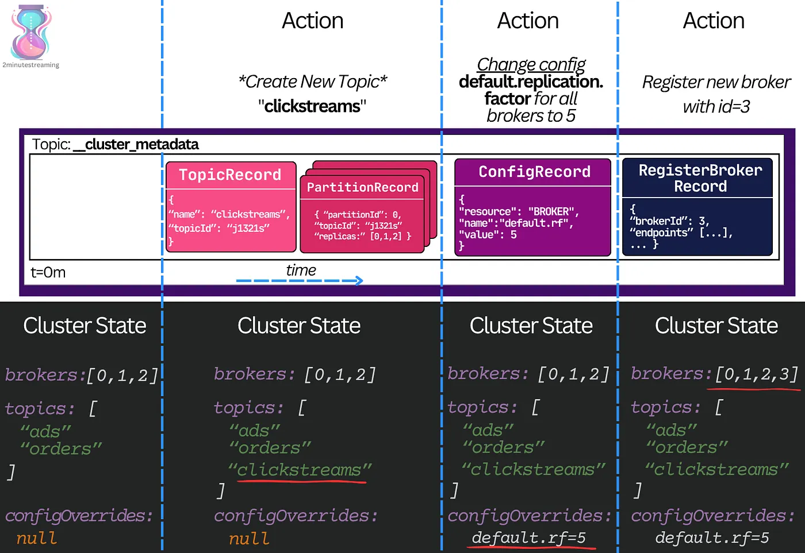
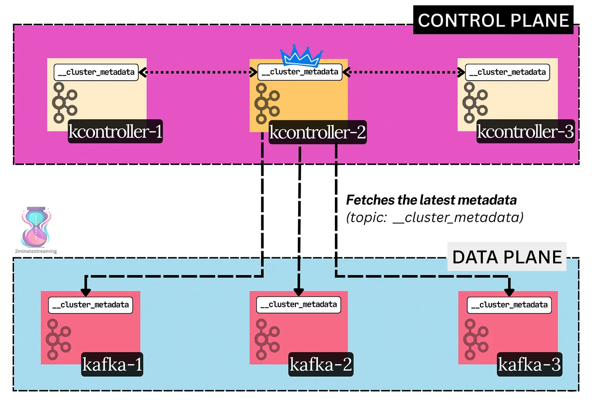
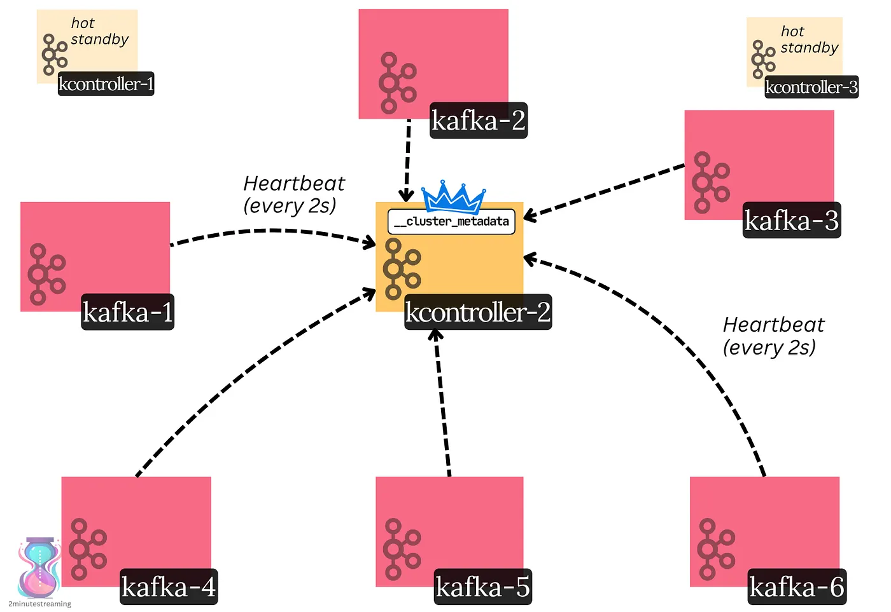
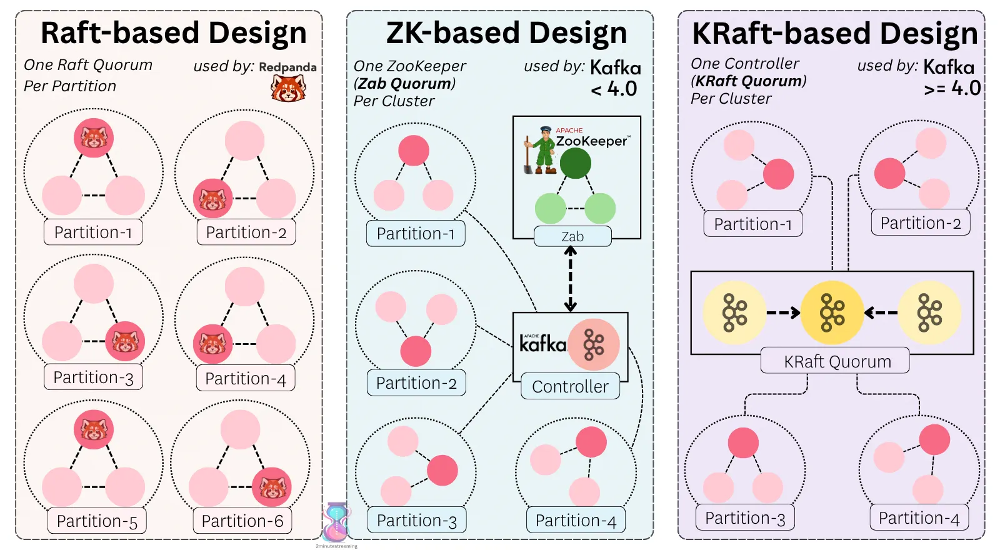

# Metadata & Controllers

## The Metadata Log

In a distributed system, all nodes must agree on the latest state of the cluster. Brokers must coordinate on certain metadata changes, like electing a new leader. This is again a distributed consensus problem.

Because it’s too complex for the purposes of introducing Kafka, we will simply gloss over how Kafka solves it.

Kafka uses a **centralized coordination model**.

> *💡* ***Centralized coordination*** *in distributed systems means all the nodes rely on a single authority, like a coordinator or a leader. This authority makes decisions, enforces rules, and keeps the state consistent. Alternative interesting models include things like quorums, gossip, and CRDTs.*

The central coordinator is none other than… **a log**.

Kafka durably stores all metadata changes in a special ***single-partition*** topic called `__cluster_metadata`. This storage model inherits all the benefits from topics. It gets fault-tolerance, durability, and most importantly for metadata, **ordering**.

Each record in the log represents a **single cluster event** (a delta). When replayed fully in the same order, a node can deterministically rebuild the same cluster end state.

> ***💡 The Stream-table duality*** *is the simple idea that a stream of events and a table are two sides of the same coin. Any mutation to a table (update/delete/insert) is in itself an event. The table simply represents the end state of all events. If you start from scratch and replay all the events, you reach the same table.*
> 
> ***Event-sourcing****, on the other hand, is the design of a system around this log-based stream of events.*
> 
> *The ideas have their roots in* ***materialized view theory*** *in databases and in* ***change data capture****. (Some sources, if you’re extra curious:* [*stream-table duality*](https://medium.com/event-driven-utopia/the-duality-of-streams-and-tables-why-it-matters-ed9bb17e7505) *and* [*event-sourcing*](https://martinfowler.com/eaaDev/EventSourcing.html)*)*

Here is a visual example of how it works in Kafka:

A representation of how cluster events represent changes in the cluster state, and how applying one after the other results in the same end-state

In other words, the cluster metadata topic partition is the source of truth for the latest metadata in Kafka.

Every broker in the cluster is subscribed to this topic. In real time, each broker pulls the latest committed updates. When a new record is fetched, the broker applies it to its in-memory metadata. This builds the broker’s idea of the latest state of the cluster.

If every broker is a follower of the partition, a natural question arises — ***who is the leader***?  
What node gets to decide what new metadata is written to this partition?

## Controllers

Controllers serve as the control plane for a Kafka cluster. They’re special kinds of brokers that don’t host regular topics — they only do specific cluster-management operations. Usually, you’d deploy three controller brokers.

Every broker reads the \_\_cluster\_metadata log and replays the event logs to recreate the latest cluster state, regardless of whether it’s a controller broker or a regular broker.

At any one time, there is only one active controller — the leader of the log. Only the active controller can write to the log. The other controllers serve as hot standbys (followers).

The active controller is responsible for making all metadata decisions in the cluster, like electing new partition leaders (when a broker dies), creating new topics, changing configs at runtime, etc.

Most importantly, it’s responsible for determining broker liveness.

> ***💡 Liveness*** *is a tricky distributed systems term that basically means that the system will eventually make progress (i.e it won’t freeze up).  
> In the context of broker liveness, it means that a dead broker will get fenced, so partitions don’t get stuck on a dead node. This allows the cluster to move forward. Liveliness technically also means that an alive broker will eventually be unfenced.*

Every broker issues [**heartbeats**](https://martinfowler.com/articles/patterns-of-distributed-systems/heartbeat.html) to the active controller. If a broker does not send heartbeats for 6 seconds straight, it is fenced off from the cluster by the controller. The controller then assigns other brokers to act as the leaders for the partitions the fenced (dead) broker led.

The careful reader will now ask:

> *If the active controller is responsible for electing partition leaders, who’s responsible for electing the* `*__cluster_metadata*` *leader?*

The `__cluster_metadata` partition is **special**. A custom distributed consensus algorithm is used to elect its leader.

## KRaft

Leader election in a distributed system is a subset of the consensus problem. Many consensus algorithms exist, like Raft, Paxos, Zab, and so on.

Kafka uses its own [Raft](https://raft.github.io/) -inspired algorithm called KRaft (Kafka Raft).

KRaft has two key roles:

**\[1\]** Elect the active controller 👑

The controller nodes comprise a Raft quorum. The quorum runs a Raft election protocol to elect a leader of the `__cluster_metadata` partition. The leader of that partition **is the active controller**.

**\[2\]** Agree on the latest state of the metadata log

Metadata updates are first appended to the Raft log on the active controller. They are marked committed only when a majority of the quorum has persisted them.

—

The active controller determines the leaders for **all the other** regular topic partitions. It writes it to the metadata log, and once committed by the controller quorum, the decision is set in stone.

In other words, the way leader election in Kafka works is:

- Leader election ***between the controllers*** (picking the active one) is done through a variant of Raft (KRaft)
- Leader election ***between regular brokers*** is done through the controller.

KRaft is a relatively recent algorithm in Apache Kafka. For many years, Kafka [used ZooKeeper](https://stanislavkozlovski.medium.com/apache-kafkas-distributed-system-firefighter-the-controller-broker-1afca1eae302). Back then, there was just one controller. It performed the same tasks as today, but critically also had the responsibilities of a regular broker. Its decisions were persisted in [ZooKeeper](https://en.wikipedia.org/wiki/Apache_ZooKeeper), which used the Zab consensus algorithm behind the scenes.

## Get Stanislav Kozlovski’s stories in your inbox

Join Medium for free to get updates from this writer.

This coordinator-based leader election model differs from other systems. For example, RedPanda (a C++ rewrite of Kafka) uses a separate Raft quorum per partition.

the different consensus designs

---

[← Previous: Kafka as a Distributed System](02-distributed-system.md) | **Next:** [Storage Features →](04-storage-features.md)
