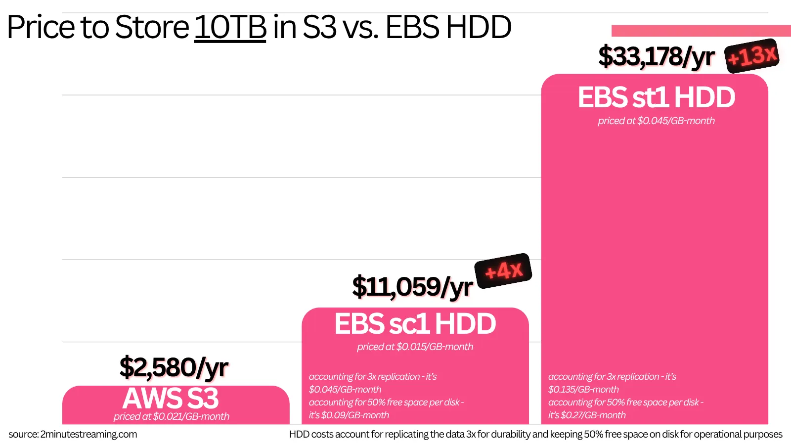
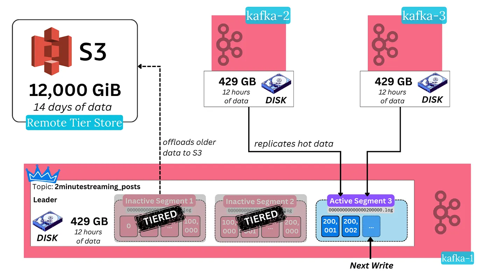
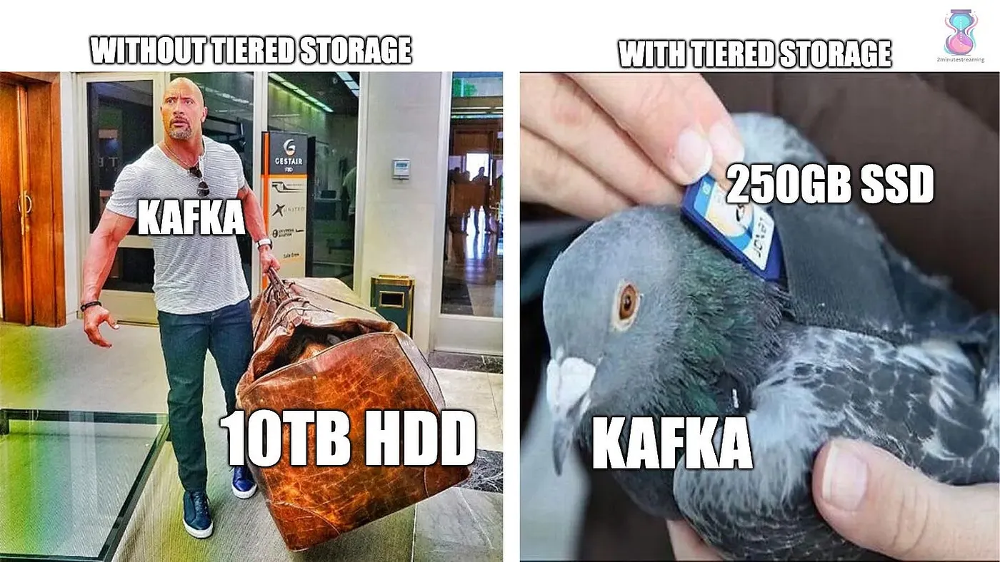

# Storage Features

## Other Features That Set Kafka Apart

## Data Retention

A key motivation in Kafka’s design was to add the ability to replay historical data and decouple data retention from clients. Alternative messaging systems would store messages as long as no client has consumed them, and once consumed, delete them.

Kafka flips this model — it offers a simple time-based SLA as the message retention policy. A message is automatically deleted if it has been retained in the broker longer than a certain period, typically 7 days. The fact that the Log data structure’s O(1) performance doesn’t degrade with a larger data size makes this feasible.

Through this model, Kafka offers the feature of **replayability** — the ability to reprocess old historical messages. That is extremely useful in cases where, for example, a consumer has had a dormant bug in it for a while and erroneously processed messages. When the bug is fixed, the correct logic can be rerun on the same messages.

## Tiered Storage

Unfortunately, at scale, it becomes extremely tricky to manage so much historical data.

A cluster with 1 GB/s of producer bandwidth would collect 1,772 TB worth of data across the cluster. Even if you tried to spread itacross 100 brokers, that’s still 17TB worth of data that each broker would have to host on its disk.

With so much state, [a lot of problems start piling up](https://blog.2minutestreaming.com/p/apache-kafka-kip-405-tiered-storage):

- ❌ The system becomes inelastic. This happens because any action or incident requires a massive amount of data to be moved. That takes a long time.
- ❌ Further, the way the cloud is priced — [durably hosting data yourself](https://aiven.io/blog/16-ways-tiered-storage-makes-kafka-better#cost) on [HDDs tends to cost](https://getkafkanated.substack.com/p/how-to-size-your-kafka-tiered-storage-cluster) **10x more** than storing it in S3.

btw if you’re interested in calculating your Kafka costs, I have a free tool — https://2minutestreaming.com/apache-kafka-calculator

The Kafka community found an ingenious way to solve [all these problems](https://aiven.io/blog/16-ways-tiered-storage-makes-kafka-better#1-simpler-operations) with one simple idea → outsource them to S3.

While it may sound overly simple or lazy, it is an **extremely elegant solution**. S3 is a [marvel of software engineering](https://bigdata.2minutestreaming.com/p/how-aws-s3-scales-with-tens-of-millions-of-hard-drives) — it is maintained by hundreds of bright Amazon engineers. It is most likely the largest scale storage system known to man.

Kafka uses a pluggable interface to store cold data in a secondary storage tier. All three cloud object stores [are supported](https://github.com/Aiven-Open/tiered-storage-for-apache-kafka) as the secondary tier, and you are free to extend it further.

In essence, the data path in modern Kafka looks like this:

1. **Hotset Tier**: Write a message to a Kafka broker, which gets replicated across the replicas in the cluster. The message is stored on disk across all three nodes. The message is asynchronously offloaded to S3 (the secondary cold tier)
2. **Cold Tier**: After a configurable amount of time (e.g., 12 hours), the message is deleted from the brokers. Its only source of truth is left in S3. It expires from S3 after a separate configurable period.

You can still read the cold historical data from Kafka using the regular APIs. The only change is that the broker now fetches it from S3 instead of its own disk.

This results in slightly higher latencies when fetching historical data, but can be alleviated through caching. Latency for hot data can improve because it makes it cost-effective to deploy performant SSDs (instead of HDDs). Throughput remains the same very high number. Kafka as a system becomes much more elastic because it no longer needs to move massive amounts of data whenever new brokers are added or removed.

Storing large amounts of data in Kafka also ends up becoming more than 10x cheaper.

---

[← Previous: Metadata & Controllers](03-metadata-and-controllers.md) | **Next:** [Consumer Groups →](05-consumer-groups.md)
