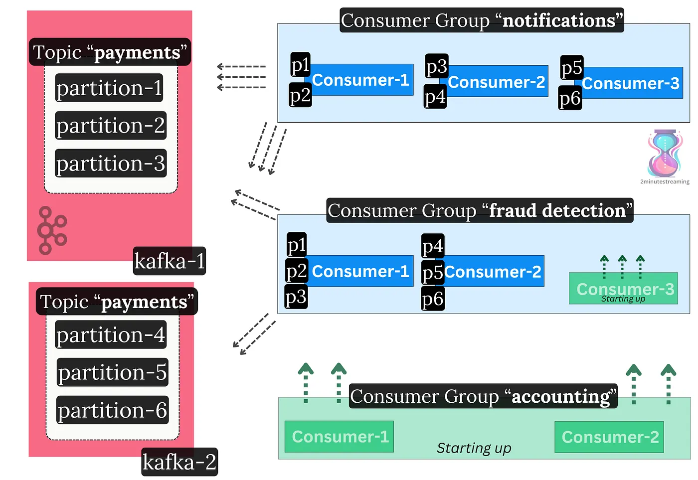
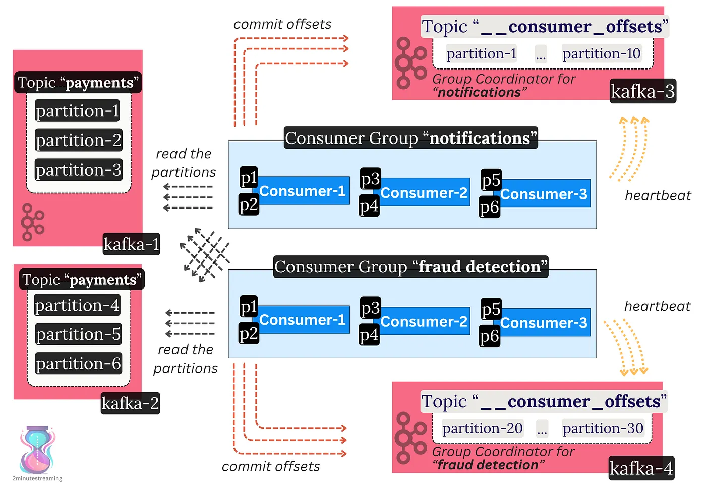

# Consumer Groups

## Consumer Groups & Read Parallelization

Recall that the log is read sequentially and in order:

- A topic is split into partitions because it’s Big Data™ — a single node shouldn’t be able to consume the whole topic. You need many consumers to handle the high volume of topic data.
- **Only one consumer** is meant to read from a partition at a time. This is done to ensure message order without needing locks.
- These consumers need to coordinate on how to split partitions between each other.
- At the same time, Kafka’s goal is to allow **parallel** consumption (multiple readers) of **the same** partition(s) for high read-fanout cases.

Kafka addresses this through **consumer** **groups**. These groups are a set of consumer client instances (typically on separate nodes) that operate as one coherent unit. They distribute the work among themselves.

Each consumer group reads topics independently at its own pace. Consumers within the same group split the partitions between each other.

Consumer Groups support dynamic membership — you can scale consumption up or down by adding or removing members at runtime.

In essence, read throughput in Kafka can be scaled in two different ways:

1. Add more **consumers** to your group
- *e.g., your topic went from 10 MB/s to 20 MB/s of throughput, and your two existing consumers can’t keep up. Add more so they take up the extra load.*

2\. Add more consumer **groups**

- *e.g., your topic is being consumed, but you’d like a new, separate application type to process the data too. For example, a nightly accounting job wants to catch up with the last day’s worth of payments.*

Two different consumer groups reading the same Kafka topic. The “fraud detection” group is expanding by adding a new consumer. A new “accounting” consumer group consisting of two consumers is starting up too.

## The Consumer Group Membership Protocol

Consumers within a group form a ***distributed processing system.*** Unsurprisingly, we hit more distributed systems’ problems — how do we coordinate the consumers? They need to:

- Establish consensus on progress (up to what offset did they read to)
- Handle liveness (did a consumer go offline, and how do we take over its work)
- Handle dynamic membership (did a new consumer come online)
- Distribute work between themselves (which consumer will take which partition)

Kafka consumers within the same group don’t talk to each other. They coordinate indirectly through a Kafka broker. The broker that leads a certain group is called the **Group Coordinator**.

Kafka again uses a **centralized coordination model** — the Group Coordinator makes the decisions. Consumers heartbeat to the coordinator and, through a pull-based model, inform themselves of what work they should do.

### The \_\_consumer\_offsets Topic

The Group Coordinator also acts as the “database” which stores the progress of each consumer.

Consumer Groups store a simple mapping of ***\`{partition, offset}*** \` in a special Kafka topic called ***\`\_\_consumer\_offsets\`***. This helps them save the progress on what record they have ***read up to.*** (key word — “up to”)

When a consumer reads messages, it commits the offset **up to** which it has processed the log via the coordinator broker. This regular checkpointing allows for smooth failovers. In the event of failure, the consumer can restart and resume from where it ended, or another consumer can come and pick the work back up.

The special offsets topic has many partitions spread throughout brokers. Each group is associated with a particular partition. The leader of the particular partition that the group is associated with acts as the Group Coordinator for that group. In that sense, every broker in the cluster can act as a coordinator for some consumer group. This prevents hot spots where one broker handles all the consumer groups in the cluster.

Two different consumer groups reading the same Kafka topic

The consumer group protocol is a critical part of Kafka.

It is generic enough to support other use cases beyond consumer groups. It therefore provides **a way for external distributed systems to establish leader election and durably persist state through Kafka**.

Keep this in mind: the next three systems we’ll discuss depend on the group protocol to work as distributed systems.

But first, a little about transactions:

---

[← Previous: Storage Features](04-storage-features.md) | **Next:** [Transactions →](06-transactions.md)
