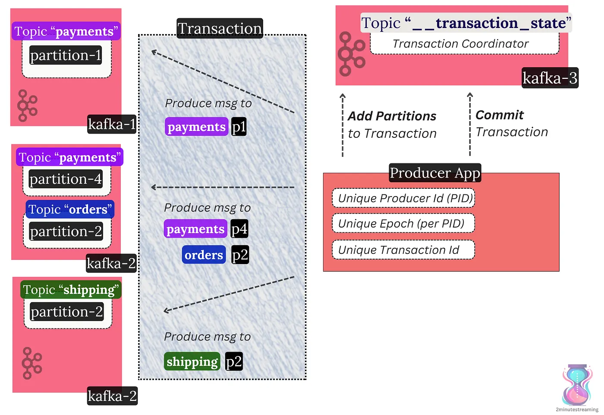

# Transactions & Exactly Once Processing

I will try to keep this brief because it can get pretty complicated — Kafka supports **transactions**. But they aren’t quite like database transactions — it’s more about message visibility control.

A transaction in Kafka means that:

- A producer can send many messages. Those messages can go to different topics or partitions. They can also reach various brokers.
- Those messages will **atomically** either be committed or aborted across all brokers.

Technically, this happens *from the perspective* *of a consumer.* In other words, the messages are still written to the topics, but consumers can be configured to skip non-committed ones. This is client-side filtering at work.

Marking transactions as committed or aborted is achieved through a two-phase commit protocol. It again relies on a centralized coordination model. A Transaction Coordinator broker makes this work. It’s pretty complex.

A producer writing messages to multiple topics and partitions in the same transaction. It manages and commits the transaction via the broker acting as the Transaction Coordinator

The important thing with transactions is that they enable message deduplication in common cases.

- **⚡️ Network/broker blips**: if the network drops the broker response packets, or the broker restarts, the same producer client will **idempotently** write its message without creating duplicates.

> ***💡 Idempotency*** *means not repeating the same action twice. If a “Create User Bob” request is sent twice, an idempotent system would create the user only once. In Kafka, this is achieved by associating a unique monotonically increasing ID with each message. So you could send the message (“Create-User-Bob, 1”) twice, but Kafka will accept it only once because of the unique ID. This is not foolproof, though, because the unique ID comes from the Kafka Producer client. Two producers can therefore create the same message with different IDs.*

- **💥 Producer client blips**: if the producer itself restarts from a clean state, it will fetch its monotonically increasing ID and bump an epoch. This way, a potentially old zombie instance with the old epoch can’t interfere with the transaction.

This doesn’t remove all cases of duplicates. Edge cases from external systems can still exist.

> ***re: the edge cases*** *— most simply said, imagine you have an HTTP service receiving requests. The service processes the request “Create user Bob” and successfully produces the message to Kafka. Before the service responds with an HTTP response to the user, it crashes. The user then retries the same HTTP request, and the new service produces the same “Create user Bob” into Kafka. From Kafka’s PoV, this is fine because it sees both as separate messages. The HTTP service evidently does not support handling idempotent requests and exactly-once processing.*

However, when reads and writes only involve Kafka (and no other external system), exactly once processing is possible.

This is actively supported and used in Kafka Streams, as we will cover shortly 👇

---

[← Previous: Consumer Groups](05-consumer-groups.md) | **Next:** [Other Kafka Components →](07-other-components.md)
