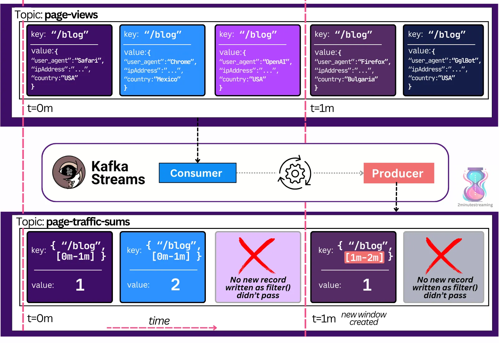
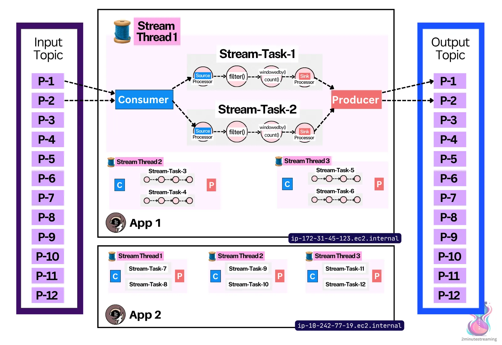
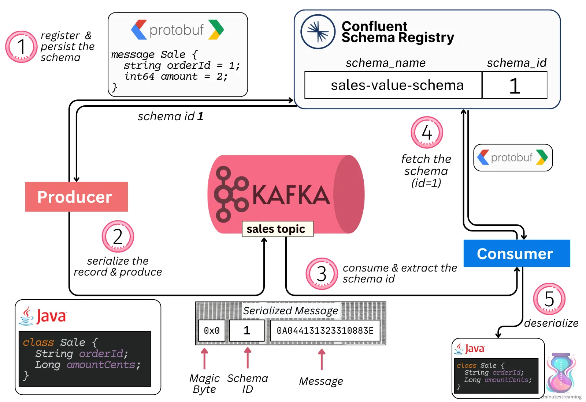
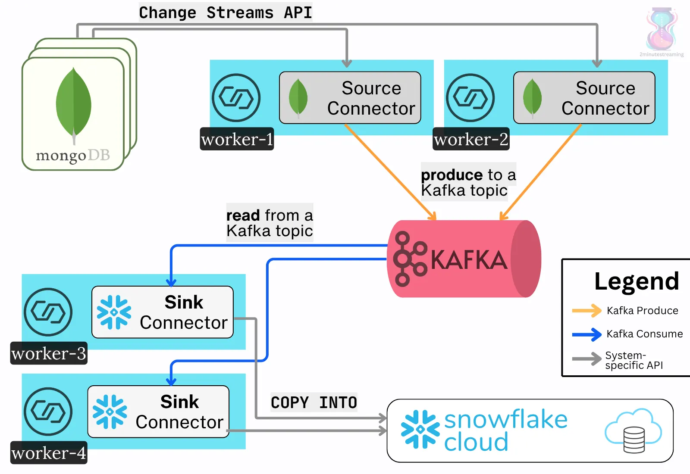

# Other Kafka Components

The [Apache Kafka GitHub project](https://github.com/apache/kafka) consists of a few components, two of which we already covered:

- **Kafka Core**: the brokers, controllers, and coordinators (back-end).
- **Kafka Clients**: the Kafka client libraries (producer, consumer).

The reason Kafka is called a distributed streaming **platform** is because it consists of more components than just those two:

1. it offers first-class stream processing (**Kafka Streams**)
2. it offers first-class integration capabilities (**Kafka Connect**).

The next three systems we will go over rely on it to function as distributed systems.

## Kafka Streams

Kafka Streams is a higher-level stream processing Java library for Kafka.

> **💡 What is Stream Processing?**
> 
> ***Stream processing*** *— the easiest way to understand it is through the opposite extreme —* ***batch processing****. Imagine you are Tesla and are collecting data from your fleet of cars. At the end of each business day, you run a big report. The report joins data from multiple sources and creates a dashboard that an executive in Tesla sees. They use it to see summaries like the number of kilometers crossed, times they had to charge the Tesla, how often X feature was used. It runs once a day and calculates data after a cut-off date (e.g., end of day). Stream Processing would be the opposite — it would have the cars continuously emit data like their tire pressure (psi). It would then perform windowed aggregations on this data to understand, in real time, what’s happening to the car. If the tire pressure went from 45psi to 41psi over the course of 15 minutes, you’d know* ***the tire is losing pressure****. If the tire pressure went from 45psi to 20psi over the course of* ***10 seconds****, you’d know you* ***blew out a tire****. Tesla could implement this example by deploying a lot of Kafka Stream jobs in their back-end. (assuming the data exists in Kafka)*

A KafkaStreams stream processor is a simple program that:

1. continuously reads a stream of messages from a set of Kafka input topics
2. performs some processing on these messages (map, filter, joins, windowed aggregations, etc.)
3. continuously write the results into an output topic

Kafka Streams is a library in that you simply import it into your app — e.g:

```c
import org.apache.kafka.streams.KafkaStreams;
```

Here is a simple pseudocode example of its declarative API:

```c
builder.stream("page-views")
.filter((page, pageView) -> !isBot(pageView))
.windowedBy(Duration.ofMinutes(1))
.count()
.toStream()
 .to("page-traffic-sums");
```

This code continuously counts the sum of human page views over the last minute and produces it to a new topic. Here’s an example of what the Kafka topics would look like:



An example of how the records in the source page view topic get processed into page traffic sums

This API is intended to be used within your own Java applications. It works like the consumer. It helps you scale by spreading the stream processing work over multiple applications (just like consumer groups do). One difference is that it also lets you spread the work through **threads**. It uses the same consumer group protocol underneath to coordinate work between instances.



An example two-node stream processing job

It is technically possible to achieve this with your own code using the simple producer/consumer libraries, but it’d be a lot of work. Kafka Streams is a higher-level abstraction above both clients with a ton of extra processing, orchestration, and stateful logic on top. 👌

Kafka Streams only works with Kafka. It takes input from a Kafka topic and sends output to another Kafka topic. This setup allows Kafka Streams to guarantee exactly once processing by using Kafka Transactions. Practically speaking, this means that it can ***atomically*** process data.

For example, it could read a set of payment messages in a Kafka topic, calculate the sum, and persist the result in another Kafka topic, with a 100% guarantee that no message was lost or double-counted in the process.

> *If interested in more, here is a quick introduction to* [*Kafka Streams*](https://bigdata.2minutestreaming.com/p/what-is-kafka-streams-api-guide)*.*

## Schema Registry

Kafka does not support types (e.g., int64) nor schemas. Messages are just raw bytes.

> **💡 What’s a Schema?**
> 
> *A* ***schema*** *basically means the expected structure of your data. A database table has a very strict schema — you know what type each field is and what fields there are (e.g id BIGINT, name VARCHAR, cost DECIMAL, is\_premium BOOLEAN). You can’t add fields or types that don’t match, like a string for an ID. A JSON object by itself is schemaless — you can modify it however you want and it’s still a valid JSON object (the only question is whether your server will accept it, and that depends on the modification). In the same way, a blob of bytes doesn’t have a strict structure — you can add any garbage in there. There is a project that adds a strict structure to JSON objects called* [*JSON Schema*](https://json-schema.github.io/json-schema/example1.html)*. Similarly, there are projects that add strict structure to blobs of bytes (*[*Protobuf*](https://protobuf.dev/)*,* [*Avro*](https://avro.apache.org/)*). It’s important to have schemas because they are critical to validating and catching bugs in your data early.*

To process a message, like summing order payment values, you need to be able to parse the message structure and the exact value field.

I believe this was a [big mistake](https://bigdata.2minutestreaming.com/i/170964904/schemaless-kafka) by the project. Every important use case, like Connect, Streams, and general processing, must understand the data’s structure.

So how is this achieved, then?

There’s no “official” way, because the open source Apache project does not support schemas. 🤦🏻‍♂️

There is a common convention, though. That is to use an external HTTP service with a database that stores the schemas.

In practice, a Kafka topic acts as this database. It stores a simple pair of ***{schema, topic}***. Kafka clients connect to the service, download the schema, and use it whenever they serialize/deserialize messages.

The first such registry was a [source-available project](https://github.com/confluentinc/schema-registry) by Confluent called Schema Registry. However, without official Apache support or a truly open-source license, the ecosystem has fragmented. There are many different service implementations today.

> *A few schema registry implementations are* [*Karaspace*](https://github.com/Aiven-Open/karapace) *(Apache-licensed),* [*AWS Glue*](https://docs.aws.amazon.com/glue/latest/dg/schema-registry-integrations.html) *(proprietary),* [*ApiCurio*](https://github.com/Apicurio/apicurio-registry) *(Apache-licensed),* [*Buf Schema Registry*](https://buf.build/product/bsr) *(proprietary),* [*and Redpanda*](https://github.com/redpanda-data/redpanda) *(mixed licenses).*

Many Kafka users also opt to manage schemas in their own unconventional ways.

The way the end-to-end path conventionally works with schemas:

1. Producers decide on a schema, associate it with a topic, and register it in the registry
2. Producers then serialize the message in the correct structure (including the unique schema ID in the message) and write it to Kafka
3. Consumers download the message, parse the schema ID, then fetch (and cache) the schema from the registry
4. Consumers use the schema to deserialize the message



## Kafka Connect

Kafka [was created to solve LinkedIn’s data integration problem](https://bigdatastream.substack.com/p/why-was-apache-kafka-created). It is meant to move data between different systems. This can be difficult because each system can have its own API, its own protocol (TCP, HTTP, JDBC, etc.), its own format (XML, JSON, Protobuf, Avro), and different compatibility guarantees.

Kafka Connect helps standardize this. Connect is both a framework (set of APIs) and a **runtime** for plugins that connect Kafka with external systems.

> *💡 A* ***runtime*** *here means that you deploy the Connect software, and then, via \`curl\`, schedule extra pre-defined code to run on top of it (plugins).*
> 
> *A* ***framework*** *means that you’re free to write your own plugins that use the API if you’d like.*

For the end user, it’s a no-code/low-code framework to plumb popular systems to Kafka and back (think ElasticSearch, Snowflake, PostgreSQL, BigQuery).

This ensures a single, standardized way to integrate systems together. The tricky bits of code that guarantee fault-tolerance, ordering, and exactly-once processing are written once (in the form of plugins) and battle-tested.



An example of Kafka Connect integrating data into Kafka. Source Connectors read data from MongoDB and write to Kafka. Sink Connectors read data from Kafka and write it to Snowflake.

Connect has three main terms one should know about:

- **Connect Workers**: the simple nodes that form a distributed Connect Cluster
- **Connect Herder**: a worker that acts as the manager of the cluster. It exposes a REST API with which users can check the status of tasks, start new ones, etc
- **Connectors**: the plugins (or libraries) that run on the workers. They contain the code needed to integrate with other systems
- A **Source** Connector reads data from an external system and writes it to Kafka (System->Kafka)
- A **Sink** Connector reads data from Kafka and writes it to an external system (Kafka->System)

The end user spins up a cluster with several Worker nodes. They install the particular Connector plugin jars on these nodes. Then, they start the integration with a simple HTTP POST request.

This again forms another distributed processing system. The Herder leader election, general cluster membership, and the distribution of new tasks throughout the group of Workers are all done transparently via Kafka’s Consumer Group protocol.

Essentially, Connect is a lot of plugin-specific integration logic on top of the regular KafkaProducer and KafkaConsumer APIs. [Hundreds of Connector plugins](https://www.confluent.io/hub/) exist, which give Kafka its incredibly rich integration capabilities.

> ***💡* rich integration (8/8)**

---

[← Previous: Transactions](06-transactions.md) | **Next:** [Conclusion →](08-conclusion.md)
