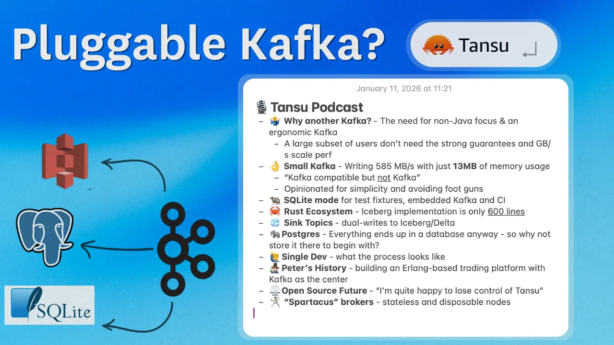

# Conclusion

## 🎬 Conclusion

With that, we’ve gone over all the important internals of Apache Kafka. I repeat the introductory sentence, which you can now hopefully understand much better:

> *💡 Kafka is an open-source, distributed, durable, very scalable, fault-tolerant pub/sub messaging system with rich integration and stream processing capabilities.*

It achieves this through many internal details, including but not limited to:

- The Producer & Consumer libraries & APIs
- Topics, Partitions, and Replicas
- Brokers and KRaft Controller Quorums
- Idempotency, Transactions, and Exactly-Once Processing
- Tiered Storage
- Consumer Groups & the Consumer Group Protocol
- Kafka Streams
- Kafka Connect
- Schema Registry

This is why Kafka is the Swiss army knife of data engineering.

It is a very active open-source project that is constantly evolving. A few notable features that are currently being worked on are:

- [Queues](https://blog.2minutestreaming.com/p/apache-kafka-share-group-queues-kip-932): the ability to read a partition with queue-like semantics. Queues have no ordering but allow for multiple consumers to read from the same log with per-record acknowledgement. This is different from Kafka’s exclusive one-consumer-per-partition model. In that model, consumers read data in order and only know “I’ve read **up until** this message”.
- [Diskless Topics](https://blog.2minutestreaming.com/p/diskless-kafka-topics-kip-1150): the ability to host topic partitions in a leaderless way. This happens by leveraging object storage (S3) as the data layer instead of brokers’ disks. This feature can cut cloud costs by **90%** + (!), further boost scalability, and simplify managing Kafka.
- [Iceberg Topics](https://aiven.io/blog/iceberg-topics-for-apache-kafka-zero-etl-zero-copy): the ability to store your Kafka data in an [open table format](https://bigdata.2minutestreaming.com/p/meet-your-new-data-lakehouse-s3-iceberg) (Iceberg) in a zero-copy way.

## ✅ When to use Kafka

I want to preface this with a disclaimer that the answer to “when to use Kafka” is inherently vague — I don’t have a perfect decision tree for it. A critical filter that cuts to the root of the decision is — do you truly, actually need a real-time per-event streaming pipeline? I usually advise against building this unless the need is clear, because streaming is a paradigm shift that is difficult to get right. Batch is always easier and preferred, if the requirements are satisfied with it.

That being said, I would summarize the following reasons as good fits for onboarding a use case through Kafka:

1. You need high **durability**. (Kafka is usually run in at least 3 nodes in 3 different AZs. PS: keep in mind this comes at a price)
2. You need high **availability**. Kafka’s failover is pretty sturdy.
3. Your data access patterns require high read fan out — you write once, but read the same piece of data multiple times
4. You need either a specific message delivery requirement, or the flexibility to choose between all (at most once, exactly once processing, more than once)
5. If you have high-volume data that is naturally modelled after the append-only Log data structure. i.e requires ordering and doesn’t require deletes or edits. Good examples are app tracking records (e.g click events), operational metrics, application logs, database change data capture.
6. If you already have a Kafka deployment (duh)
7. You benefit from replayability of event data (reading old data in the order it came in).
8. When you rank career stability/safety highly (nobody fired anybody for using Kafka)

## ❌ When should I NOT use it

Despite loving Kafka and talking about it all the time, I love practicality more. I urge users to **not** adopt yet another complicated distributed system when there’s not a strong need for it. A lot of organizations have the tendency to over-engineering their solutions.

> ***💡* Over-Engineering**: *We generally have this “cargo cult” of scalability that wants to overdesign everything to handle imaginary circumstances. Nowadays, we are finally beginning to see the pendulum start swinging back with the growth of the* [*Small Data movement*](https://topicpartition.io/definitions/small-data) *and the* [*Just Use Postgres*](https://www.manning.com/books/just-use-postgres) *movement. As somebody who has worked on big data infrastructure and seen plenty of production workloads, I subscribe to their idea which says that most organizations don’t have anything close to “big” data and are over-engineering their solutions. Most importantly, hardware power is growing at a faster rate and many common workloads can be handled on a single modern machine. See DuckDB’s success, their* [*Big Data is Dead*](https://motherduck.com/blog/big-data-is-dead/) *blog post and* [*Small Data Manifesto*](https://motherduck.com/blog/small-data-manifesto/)*. On the same note — somebody once called Kafka the “MongoDB of sequential storage” and that quote lives rent free in my head to this day. The similarity is that it was also built for* [*webscale*](https://www.youtube.com/watch?v=b2F-DItXtZs) *and then widely adopted based in part on impressive performance numbers without much regard for how fit it for the use case.*

Teams should carefully weigh the organizational overhead of adopting a new technology versus using something simpler, like infrastructure that’s already deployed. I made this convincing argument in deeper detail in my recent piece [“Kafka is fast — I’ll use Postgres”](https://topicpartition.io/blog/postgres-pubsub-queue-benchmarks) where I compare both systems (as crazy as that sounds). That piece did extremely well on HackerNews and even prompted a response by Confluent.

In any case, here are some points on when Kafka may not be the best choice:

1. You just want to introduce some simple async background task processing. [Redis is the industry default for this](https://github.com/topics/background-jobs) with first-class library support. Although Kafka (and other systems) can do just as good of a job, many devs will prefer to use an established library than build one from scratch or use something that’s less maintained.
2. You want **queue-like** semantics — no strict ordering, granular record-level acknowledgement and retries. Kafka isn’t a queue (more on this in the next paragraph). Although it [is adding support](https://blog.2minutestreaming.com/p/apache-kafka-share-group-queues-kip-932) for queue-like workloads now, it’s still early and other systems are better established. I would definitely say [Just Use Postgres](https://topicpartition.io/blog/postgres-pubsub-queue-benchmarks) here.
3. You want queue-like semantics and more **server-side routing logic**. Things like server-side filtering, built-in dead letter queue handoff, priority queue semantics, routing based on payload, complex hierarchy or wildcard routing. [RabbitMQ](https://www.rabbitmq.com/) is more up your alley.
4. You need a **lightweight** protocol and/or an absurdly high number of clients — e.g. something like MQTT for tens/hundreds of thousands of IoT devices. Kafka does not support that protocol out of the box ([bridges exist](https://github.com/strimzi/strimzi-mqtt-bridge) though), nor is it designed to handle that many client connections. Another system would be a better fit.
5. You need extremely low latency (<15ms p99 e2e). Some Kafka vendors sell [low](https://www.redpanda.com/blog/kafka-kraft-vs-redpanda-performance-2023) [latency](https://www.confluent.io/blog/kafka-vs-kora-latency-comparison/) solutions, but open-source Kafka can find it hard to **consistently** keep such low latency. The system was simply never super optimized for such extreme low latency. Another system may be a better fit.
6. Small Scale. You’re pushing miniscule amounts of data — e.g kilobytes/s. Provisioning 3 Kafka nodes to handle KB/s can be overkill. Remember Kafka was highly marketed and adopted for its ability to scale. If your problem(s) can be solved with the infrastructure you already have now, use that. Premature optimization is the root of all evil.
7. You’re a fan of your cloud provider, prefer to keep it all in one place and aren’t afraid of being locked in. AWS has Kinesis, Google has Pub/Sub and Azure has Event Hubs. These systems aren’t necessarily better than Kafka (scalability, cost, performance, etc.), but they’re supported in a more first class way by the cloud providers. AWS has a managed Kafka service (MSK), Google has a managed Kafka service and Azure exposes a Kafka API through Event Hubs. But none of these offerings seem to be as polished as the cloud provider’s primary competitor systems.

Many alternative proprietary (and OSS) systems compete with Apache Kafka. The one common denominator is that **they all** use the same Kafka protocol and API. They just implement it differently. These include, but are not limited to, Confluent Kora, AWS MSK, RedPanda, WarpStream, StreamNative Ursa, BufStream, Aiven Inkless, AutoMQ, Tansu and more.

> *👉 My favorite up-and-coming one is* [*Tansu*](https://github.com/tansu-io/tansu)*. A Rust-based implementation of Kafka on top of Postgres (and more)  
> I recorded a 2hr30m+ podcast with the founder here:* [https://www.youtube.com/watch?v=pJQ7hcsI1Dw](https://www.youtube.com/watch?v=pJQ7hcsI1Dw) *(not sponsored)*

The space is incredibly rich and rapidly evolving. I have a ton more I can talk about it. If you’re further interested in the world of event streaming and Apache Kafka, make sure to stay in touch. 🙂

## 👋 Enjoyed This?

This whole blog post was free. Others would charge you in the form of courses or books to teach you the exact same thing, whiel also taking 10x more of your time.

👉 If you’d like to “pay back”, the best way is to simply give this article some claps and share it with friends. Posting it to social forums like Reddit/HackerNews helps a lot too.

👉 If you’d like to read more extremely high-quality technical content re: Kafka and Distributed Systems, feel free to follow me on all the platforms:

> YouTube: [https://www.youtube.com/@StanKozlovski](https://www.youtube.com/@StanKozlovski/videos)  
> X (Twitter): [https://x.com/kozlovski](https://x.com/kozlovski)  
> LinkedIn: [https://www.linkedin.com/in/stanislavkozlovski/](https://www.linkedin.com/in/stanislavkozlovski/)  
> Substack: [https://bigdata.2minutestreaming.com/](https://bigdata.2minutestreaming.com/)  
> My concise 2-minute newsletter: [https://blog.2minutestreaming.com/](https://blog.2minutestreaming.com/)

*Thanks for reading. ~Stan*

---

[← Previous: Other Kafka Components](07-other-components.md)
